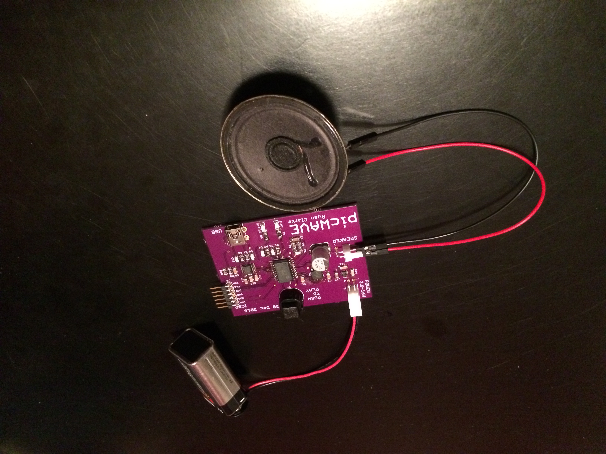
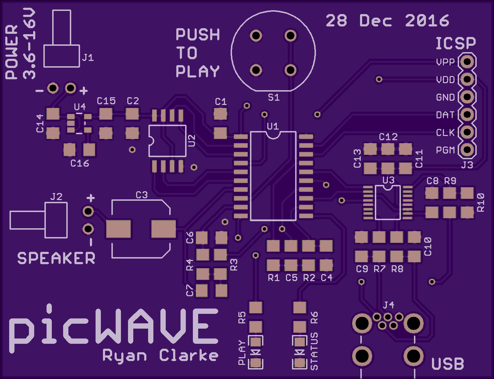
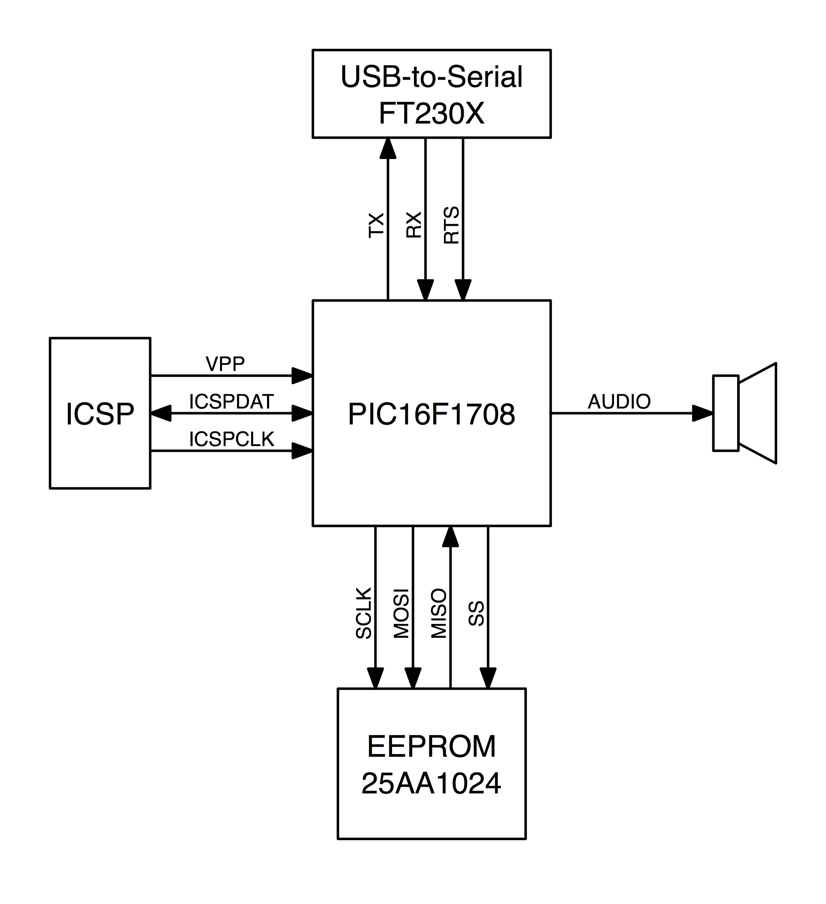
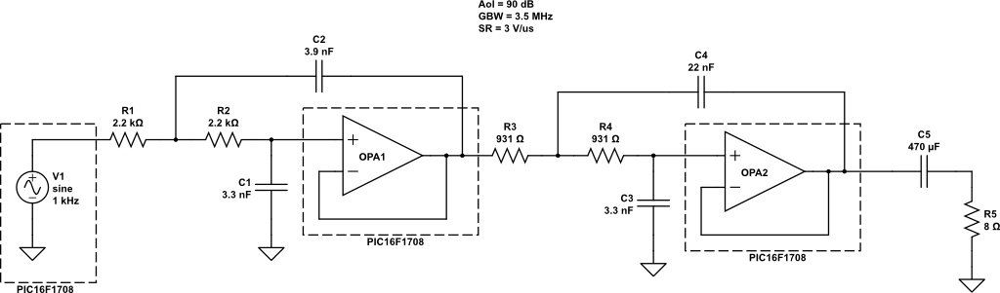
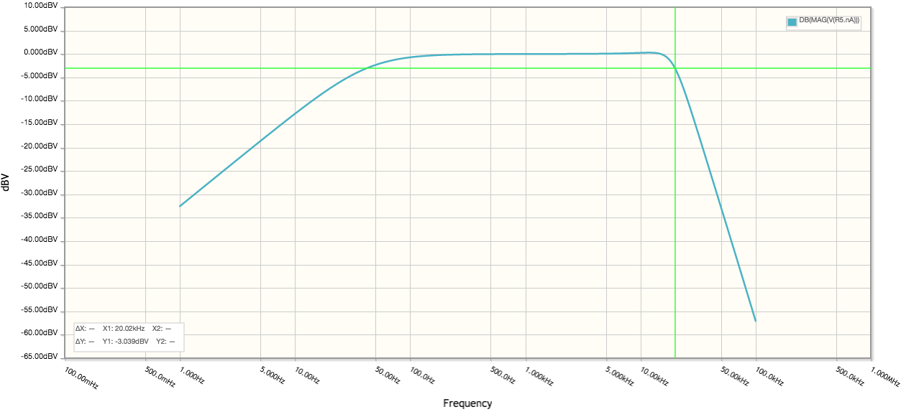
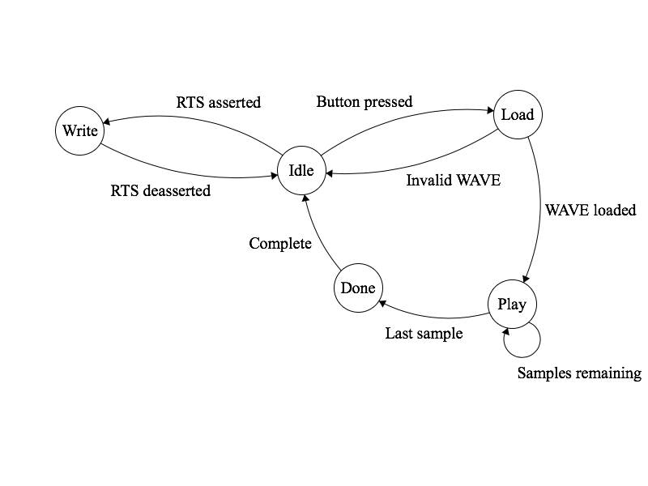

# picWAVE

**An embedded PCM audio player built around the Microchip PIC16F1708 microcontroller, combining digital audio processing, SPI memory, and integrated analog peripherals.**

picWAVE is a custom embedded audio playback system developed in 2016–2017. It uses a PIC16F1708 microcontroller to retrieve uncompressed PCM audio from an external SPI EEPROM, convert the samples into an analog signal using the microcontroller's integrated DAC, and reconstruct the audio through an analog low-pass filter implemented with its integrated operational amplifiers.

The system includes custom hardware, embedded C firmware, and a Python utility for transferring audio recordings from a computer over a USB-to-UART interface.

The project was originally conceived as an exploration of mixed-signal embedded design, demonstrating how an inexpensive 8-bit microcontroller could perform digital audio playback while minimizing external analog components.

<p align="center">
  
  &nbsp;
  
</p>

### Key features

- **Embedded audio playback:** 44.1 kHz, 8-bit, mono PCM WAVE format.
- **Integrated analog peripherals:** Uses the PIC16F1708's internal DAC and operational amplifiers.
- **External nonvolatile storage:** Microchip 25AA1024 SPI EEPROM with 128 KiB capacity.
- **Analog reconstruction:** Fourth-order Butterworth low-pass filter implemented as two cascaded Sallen–Key stages.
- **Timer-driven playback:** Hardware timer interrupts regulate sample output.
- **Computer interface:** FTDI USB-to-UART bridge operating at 1 Mbps.
- **Python audio loader:** Transfers recordings to EEPROM without reflashing firmware.
- **Custom hardware:** Original circuit schematic, PCB layout, and bill of materials.

> **Project status:** Historical engineering project preserved for reference and portfolio purposes. The original source and hardware design have not been revalidated against current development tools.

## System architecture

picWAVE consists of three principal components: a host-side audio loader, embedded firmware, and a mixed-signal hardware platform.

```text
                 Host Computer
                ┌───────────────┐
                │ Python Loader │
                └───────┬───────┘
                        │ USB
                        ▼
                ┌───────────────┐
                │ FTDI FT230X   │
                │ USB-to-UART   │
                └───────┬───────┘
                        │ UART / RTS
                        ▼
                ┌────────────────────────┐
                │       PIC16F1708       │
                │                        │
                │  UART ──► SPI          │
                │            │           │
                │            ▼           │
                │         EEPROM         │
                │            │           │
                │            ▼           │
                │       Sample Buffer    │
                │            │           │
                │       Timer 2 Control  │
                │            │           │
                │            ▼           │
                │       Integrated DAC   │
                │            │           │
                │            ▼           │
                │     Integrated Op Amps │
                └────────────┬───────────┘
                             │
                             ▼
                    Analog Audio Output
```



### Hardware

The original design incorporates:

| Component | Function |
|---|---|
| Microchip PIC16F1708 | Main controller, SPI/UART interfaces, DAC, and operational amplifiers |
| Microchip 25AA1024 | 1 Mbit SPI EEPROM for audio storage |
| FTDI FT230X | USB-to-UART interface |
| Texas Instruments LP2985 | 3.3 V voltage regulator |
| External passive components | Analog reconstruction filters |
| Pushbutton and LEDs | Playback control and system status |

The PCB schematic and layout are available in the [`schematic/`](schematic/) directory.

### Analog audio reconstruction

A central design objective was to exploit the PIC16F1708's integrated analog peripherals rather than employ an external audio DAC and operational amplifier ICs.

The design uses the microcontroller's internal 8-bit DAC to produce a voltage proportional to each PCM sample.

The resulting staircase waveform is passed through two cascaded second-order Sallen–Key low-pass filter stages. Together, these form a fourth-order Butterworth reconstruction filter with a nominal cutoff frequency of 20 kHz.

The filter uses the microcontroller's integrated operational amplifiers in conjunction with external resistors and capacitors.

This approach reduces the number of active components required for the audio output stage and demonstrates the integration of digital and analog circuitry within a resource-constrained microcontroller.

<p align="center">
  
  <br />
  
</p>

## Firmware

The firmware is written in C using Microchip's XC8 compiler and organized around a five-state controller.

| State | Description |
|---|---|
| Idle | Waits for a playback button press or an audio upload request |
| Write WAVE | Receives audio over UART and writes it to EEPROM |
| Load WAVE | Reads and validates the WAVE header |
| Play WAVE | Reads PCM samples from EEPROM and updates the DAC |
| Done | Stops playback and disables analog peripherals |



### Audio playback

When playback is requested, the firmware reads the WAVE header from EEPROM and verifies that the recording uses the supported audio format.

It then initiates a sequential SPI read beginning at the audio data offset.

Timer 2 generates periodic interrupts that signal when the next sample should be output. The main firmware loop writes the current sample to the DAC and retrieves the following sample from EEPROM.

By keeping the EEPROM selected during playback, the firmware avoids repeatedly transmitting SPI read commands and addresses.

At the end of playback, the firmware stops Timer 2, returns the DAC to its midpoint, disables the analog peripherals, and resumes waiting for another command.

### Audio storage

Audio recordings are stored in a Microchip 25AA1024 EEPROM.

The device provides:

- 1 Mbit (128 KiB) of nonvolatile storage.
- SPI communication.
- 256-byte write pages.
- Sequential byte reads.

The available storage provides approximately **2.97 seconds of audio at 44.1 kHz, 8-bit mono**, after accounting for a standard 44-byte WAVE header.

## Audio upload utility

The repository includes a Python command-line utility that transfers a replacement audio recording to the device using an FTDI USB-to-UART interface.

The utility communicates at 1,000,000 baud and uses the RTS signal to request upload mode.

A simple application-level protocol coordinates the transfer:

1. The host asserts RTS to request an upload.
2. The microcontroller identifies itself using the `PICW` signature.
3. The host acknowledges the device and supplies the number of EEPROM pages to write.
4. The microcontroller requests successive 256-byte blocks.
5. The host transmits each block for storage in EEPROM.
6. The host releases RTS when transmission is complete.

The loader displays upload progress and elapsed transfer time.

Audio recordings can be replaced without reprogramming the PIC16F1708.

### Requirements

- Python 3
- [pySerial](https://pyserial.readthedocs.io/)
- Compatible FTDI USB-to-UART interface
- Programmed picWAVE hardware

Install the Python dependency:

```bash
python3 -m pip install pyserial
```

Upload a recording:

```bash
python3 loader/picwave.py --device /dev/ttyUSB0 audio.wav
```

Replace `/dev/ttyUSB0` with the appropriate serial device.

For example, macOS commonly uses devices named `/dev/tty.usbserial-*`, while Windows uses names such as `COM3`.

### Supported audio format

| Parameter | Requirement |
|---|---|
| Container | RIFF/WAVE |
| Encoding | Uncompressed PCM |
| Channels | Mono |
| Sample rate | 44,100 Hz |
| Sample depth | 8-bit unsigned |
| Header | Standard 44-byte PCM WAVE header |
| Maximum file size | 131,072 bytes |

The firmware expects a conventional WAVE header with a 16-byte `fmt ` chunk followed immediately by the `data` chunk.

Files containing additional metadata chunks may not be compatible.

### Firmware source

The `picWAVE.X/` directory contains the embedded firmware.

- `main.c` — Hardware initialization, playback state machine, and interrupt handling.
- `wav.c` — WAVE header validation and EEPROM transfer routines.
- `config.c` — PIC configuration settings.
- `include/` — Hardware definitions, constants, and interfaces.

### Hardware design

The `schematic/` directory contains the original circuit design and supporting files:

- `picWAVE.sch` — Circuit schematic.
- `picWAVE.brd` — PCB layout.
- `bom.xlsx` — Bill of materials.

These files document the original hardware implementation.

## Building the firmware

The firmware was developed using Microchip MPLAB X and the XC8 compiler.

Rebuilding requires:

- Microchip MPLAB X IDE.
- A version of XC8 compatible with the original source.
- PIC16F1708 device support.
- A compatible ICSP programmer.

The original project used a PICkit 3.

The repository contains the firmware source but does not include a complete MPLAB X project configuration.

To reconstruct the development environment, create a PIC16F1708 project, import the files under `picWAVE.X/src/`, and configure the compiler to use `picWAVE.X/include/`.

The original IDE and compiler versions were not recorded, and compatibility changes may be necessary when using current tools.

## Engineering considerations and limitations

picWAVE was designed as an experimental embedded system rather than a production audio player.

The preserved implementation has several characteristics worth considering when studying or reproducing the design.

**Clock and playback timing**

The firmware configures the internal oscillator for 16 MHz, while the `_XTAL_FREQ` definition specifies 32 MHz.

Additionally, the Timer 2 configuration produces a nominal playback rate of approximately 43.48 kHz at a 16 MHz oscillator frequency, rather than precisely 44.1 kHz.

These discrepancies should be resolved before reproducing or modifying the firmware.

**Audio format validation**

The firmware expects a fixed WAVE header layout and does not implement a general-purpose RIFF parser.

It also does not fully validate all relationships between chunk sizes and available EEPROM capacity.

**EEPROM transfers**

The upload protocol is intentionally simple. It does not include checksums, readback verification, or a final confirmation that all EEPROM writes completed successfully.

**Interrupt handling**

The sample-ready flag is shared between the interrupt service routine and the main execution loop. Its declaration should be reviewed for `volatile` qualification when rebuilding or modifying the firmware.

**Power management**

The firmware disables the DAC and operational amplifiers when playback finishes but does not enter a low-power sleep mode while idle.

These observations describe the preserved implementation; they are not changes incorporated into the firmware.

## Project background

picWAVE was developed in 2016–2017 as a personal exploration of embedded systems and mixed-signal electronics.

The project brought together several areas of electrical and computer engineering, including microcontroller programming, synchronous serial communications, nonvolatile memory, digital-to-analog conversion, active analog filtering, and custom PCB design.

A companion technical article, *picWAVE: Exploring Mixed Signals with a PIC*, was prepared for submission to *Nuts & Volts* magazine but was not published.

The project is preserved as an example of embedded hardware/software integration and as part of the [Fox Run Labs](https://github.com/foxrunlabs) engineering portfolio.

## License

The firmware and Python loader are released under the [MIT License](LICENSES/MIT.txt).

Hardware design files and schematics are licensed under the [CERN Open Hardware License Version 2 – Permissive (CERN-OHL-P-2.0)](LICENSES/CERN-OHL-P-2.0.txt).

Copyright © 2016 Ryan Clarke
